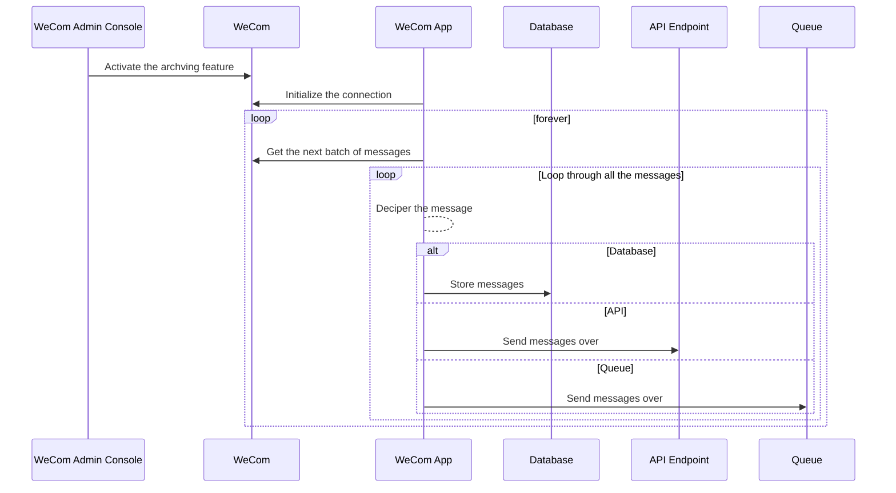

There are several methods to create programs for WeCom. A company can develop and launch internal programs, an external entity can offer third-party applications for a company to approve, or consultants can develop applications on behalf of a company. Based on the nature of these applications, different restrictions may apply.

Archiving is an enterprise feature that has been available for many years. A company can enable archiving to allow WeCom to automatically capture individual or group chats. Employees need to opt-in for this feature, and external parties must also give their consent. However, not sure if/how the employees or external parties can opt-out.

WeCom APIs support proactively gathering archived messages and have been doing so for several years. Here is the high-level sequence diagram.



In summary, you need to continuously pull messages from WeCom, then decrypt, parse, and store them to the designated destination. Each message contains details such as the type of action, message time, sender, receivers, room ID, message type, and content. Be aware that WeCom has throttling controls in place at various points.

```
